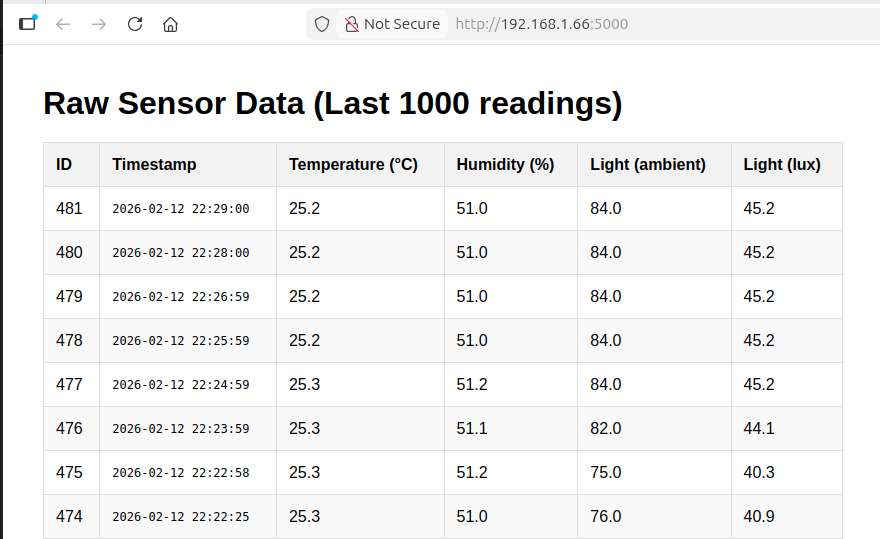

# Sleepy Board (v0)

The Sleepy Board can be used to capture temperature, humidity and brightness data. Data is read from sensors connected to a microcontroller, which is then transmitted to a database over wifi. I live right next to a main road and wanted to know what my room looks like once I have fallen asleep.

This version, my latest weekend project, is a prototype. The aim of this exercise is to see how quickly I can get a system up and running using all the off the shelf bits of hardware and electronics I can find. the firmware was the easier part - thanks to guides and libraries from Adafruit. The HTML files were generated using AI.

## Connecting the hardware
I have a RaspberryPi Pico 2W connected to the following sensors on the same I2C bus.

| Sensor             | Part number | I2C Addr | Reference links    |
|--------------------|-------------|----------|--------------------|
|Temperaure, Humidity| AHT20       | 0x38     | [link](https://learn.adafruit.com/adafruit-aht20) |
|Brightness          | VEML7700    | 0x10     | [link](https://learn.adafruit.com/adafruit-veml7700) |

| Signal  | Pin on Pico | Ref. colours|
|---------|-------------|-------------|
| I2C_SDA | GP0         | Blue        |
| I2C_SCL | GP1         | Yellow      |


## Setting up the Pico
Using circuitpython since it is, in my opinion, the easiest to use. I am using [CircuitPython 10.0.3](https://circuitpython.org/board/raspberry_pi_pico2_w/), which is the latest at the time of writing this. There are multiple files  in the Firmware folder.

- I2C scanner: Scan all the I2C addresses and list connected devices.
- Read sensor data: More information can be found in the individual .py file.
- Basic Wifi Test: [This](https://learn.adafruit.com/pico-w-wifi-with-circuitpython/pico-w-basic-wifi-test) is a quick guide from Adafruit on how to get the Pico to connect to the internet. Don't forget to update `settings.toml` with the correct Wifi SSID and password. 
- These two files and then combined into another script that is used to send data to the server.

## Setting up the server
I used flask to set up a server on my laptop. 

Things to keep in mind:
1. Identical JSON formats on the server and the Pico
2. Correct URL on the Pico (use `ifconfig` to find the IP address of the device the Pico needs to talk to)
3. Don't `break` when you see an Exception - keep trying.

## Running everything together
1. To run the server run `Software/start.sh`. This script sets the python environment and starts the server.
```
cd Software
chmod +x start.sh
./start.sh
```

2. Transfer the files in the Firmware folder onto the Pico. Start sending data.
3. Open the correct address on a web browser conencted to any device on the same wifi network et voilà !


## Results



## Data sent by the Pico

Here is the terminal output from the Pico

```
Hello World!

Connecting to WiFi
Connected to WiFi
pool created
ssl context created
request created
sending: {'humidity': 51.1572, 'temperature': 25.2956, 'light_ambient': 75, 'light_lux': 40.32}
Response: 200 Body: {"status":"success"}

sending: {'humidity': 51.1022, 'temperature': 25.2697, 'light_ambient': 82, 'light_lux': 44.0832}
Response: 200 Body: {"status":"success"}

sending: {'humidity': 51.1513, 'temperature': 25.2647, 'light_ambient': 84, 'light_lux': 45.1584}
Response: 200 Body: {"status":"success"}

sending: {'humidity': 51.0452, 'temperature': 25.2292, 'light_ambient': 84, 'light_lux': 45.1584}
Response: 200 Body: {"status":"success"}

sending: {'humidity': 51.003, 'temperature': 25.226, 'light_ambient': 84, 'light_lux': 45.1584}
Response: 200 Body: {"status":"success"}

sending: {'humidity': 50.9624, 'temperature': 25.2094, 'light_ambient': 84, 'light_lux': 45.1584}
Response: 200 Body: {"status":"success"}

sending: {'humidity': 50.9853, 'temperature': 25.2172, 'light_ambient': 84, 'light_lux': 45.1584}
Response: 200 Body: {"status":"success"}

sending: {'humidity': 50.9627, 'temperature': 25.217, 'light_ambient': 81, 'light_lux': 43.5456}
Response: 200 Body: {"status":"success"}
```